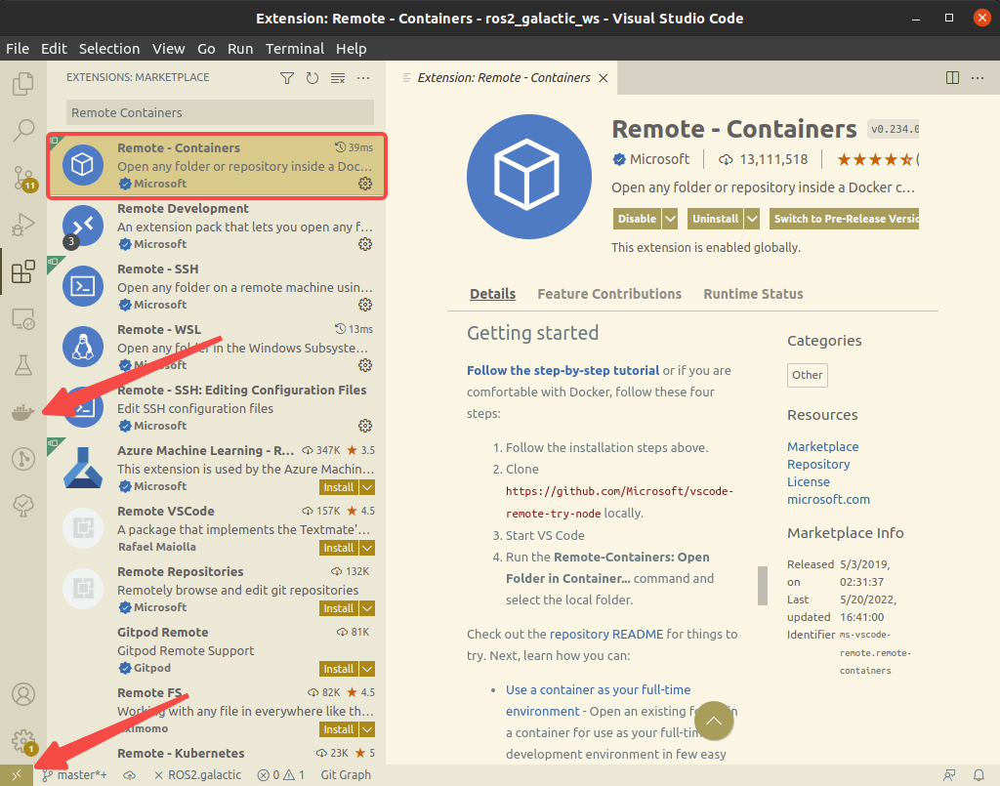
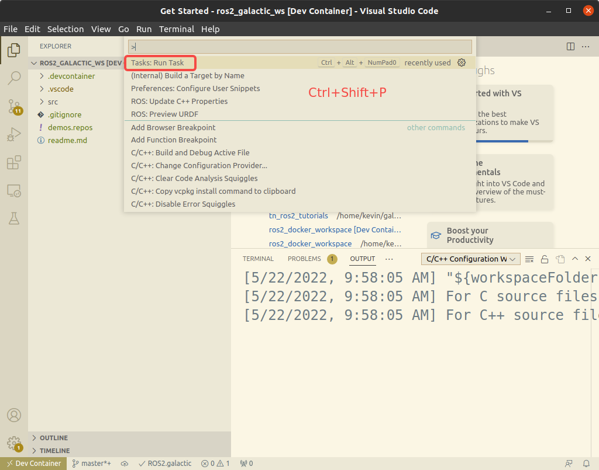
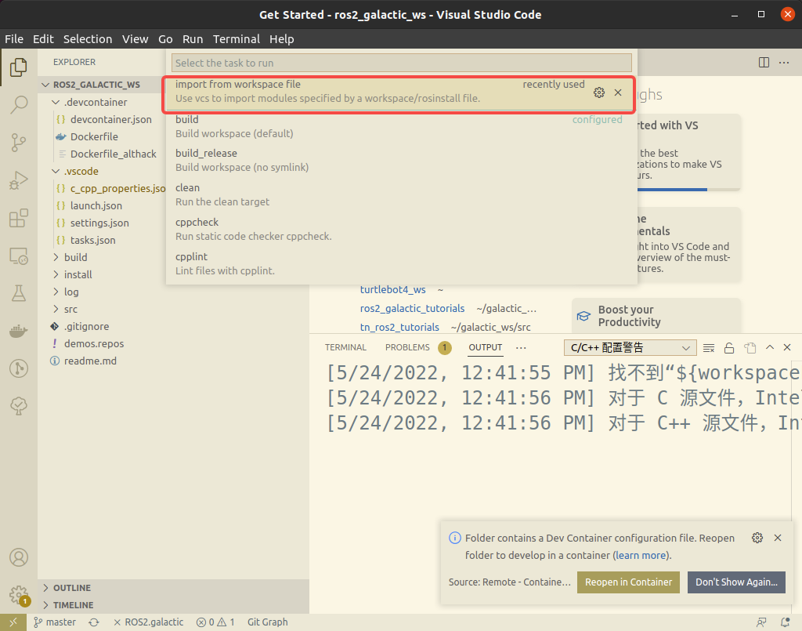
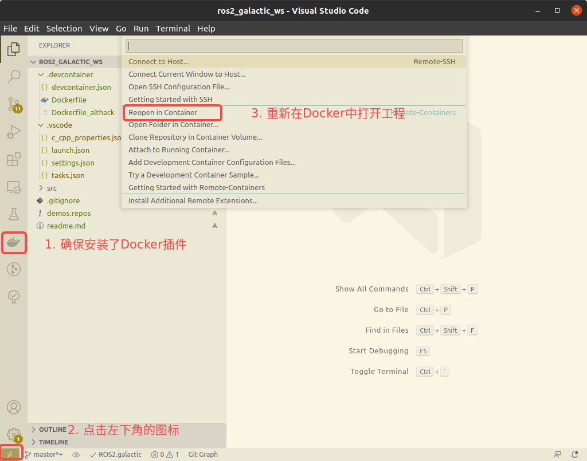
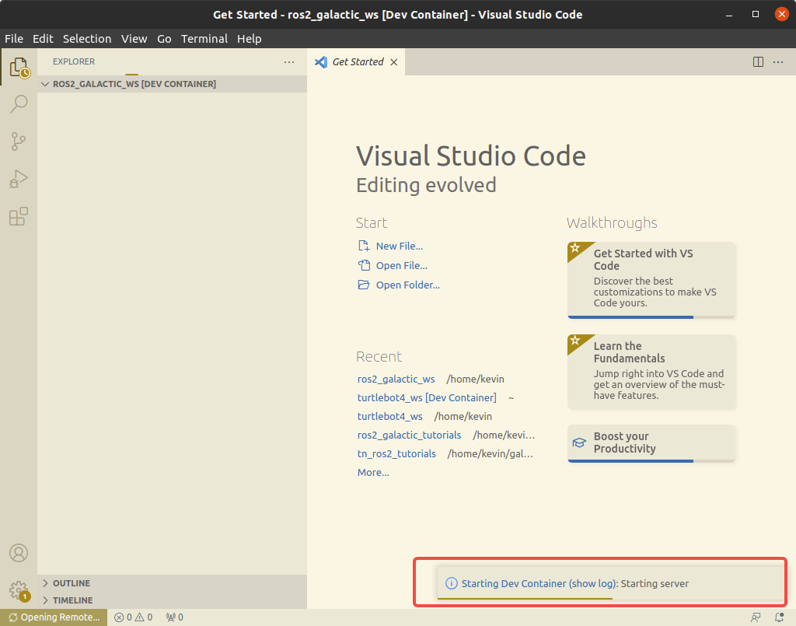
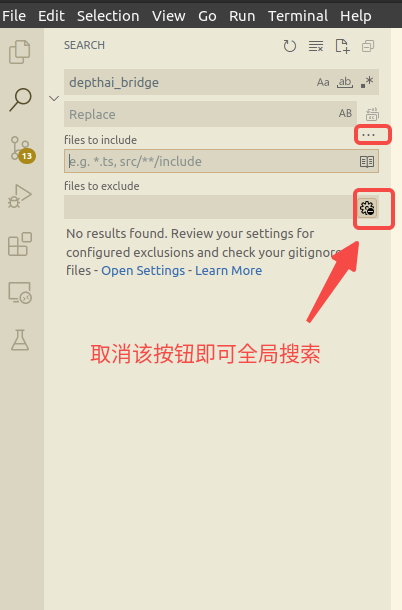

不知道阅读本篇文章的你有没有被环境配置搞的焦头烂额过？

想要验证一个功能包，但却需要安装各种依赖。装就装吧！但是安装的依赖可能更新本机中的一些配置或软件版本，导致过去可以运行的软件这么折腾一下后就不能再运行了。

这时可能又后悔又懊恼。严重的可能要重新安装电脑系统。

本文描述了一种在`Docker`环境中开发和调试`ROS`程序的方法。旨在解决环境配置和软件依赖给我们带来的困扰。

我们使用`Docker`+`Vscode`来构建开发环境。下面的操作在`Ubuntu 20.04 LTS`上验证过。对于其他操作系统，操作步骤应该也是一致的。

## 安装Docker

按照下面的命令安装`Docker`。

```bash
# step 1: 安装必要的一些系统工具
sudo apt-get update
sudo apt-get -y install apt-transport-https ca-certificates curl software-properties-common

# step 2: 安装GPG证书
curl -fsSL http://mirrors.aliyun.com/docker-ce/linux/ubuntu/gpg | sudo apt-key add -

# Step 3: 写入软件源信息
sudo add-apt-repository "deb [arch=amd64] http://mirrors.aliyun.com/docker-ce/linux/ubuntu $(lsb_release -cs) stable"

# Step 4: 更新并安装 Docker-CE
sudo apt-get -y update
sudo apt-get -y install docker-ce

# Step 5: 查看docker是否安装成功
docker version

# Step 6: 安装x11
sudo apt-get install x11-xserver-utils 
```


## 安装Vscode和插件

`vscode`的安装就不多说了。

需要安装的插件是`Remote Containers`。可按下图操作。



在插件市场中搜索`Remote Containers`并安装就可以看到左侧的`Docker`标志和左下角的图标。


## 开发环境示例

- 下载开发环境示例

```bash
git clone https://github.com/shoufei403/ros2_galactic_ws.git
```

- 在本机打开开发环境

```bash
cd ros2_galactic_ws
code .
```

- 导入工程代码

在文件夹中的`demos.repos`中维护了需要导入的工程代码。可根据需求自行修改。目前里面是放的自己收集整理的`ROS2`示例代码。

导入工程代码是通过运行`vscode`的`task`来进行的。`task`的内容维护在`.vscode/tasks.json`文件中。



按照上图所示，按快捷键`Ctrl+Shift+P`打开命令面板。选中`Run Task`将可以看到`.vscode/tasks.json`文件中维护的各项`task`。




如上图，选中`import from workspace file`任务即可导入`demos.repos`文件中维护的工程代码。如果后面需要更新工程代码则可再次运行`import from workspace file`任务。


- 在`docker`中重新打开环境



第一次打开时会下载`docker`镜像需要一段时间。后来再打开开发环境就是秒开了。




- 安装依赖

  运行`install dependencies`任务可以根据工程代码安装相应的依赖。但有些依赖可能还是要手动安装。如果`install dependencies`任务运行报错，则可以根据报错信息手动安装依赖。

- 编译工程代码

  运行`build`任务即可编译。你也可以设置快捷键来对应`build`任务。


**另外**，全局搜索时需要注意一下**设置**。如果`files to exclude`为空，并且后面的图标按钮被选中，则只会在打开的文件中搜索。




## 在Docker中运行GUI应用

`devcontainer.json` 中的 runArgs 字段中添加 `--volume=/tmp/.X11-unix:/tmp/.X11-unix` 表示挂载 x11 相关目录到容器中。

`containerEnv` 字段中添加 "DISPLAY": "${localEnv:DISPLAY}" 表示设定容器中的 DISPLAY 环境变量与本地 DISPLAY 为一样的值，例如：

```yaml
{
	"dockerFile": "Dockerfile",
	"build": {
		"args": {
			"WORKSPACE": "${containerWorkspaceFolder}"
		}
	},
	"remoteUser": "ros",
	"runArgs": [
		"--network=host",
		"--cap-add=SYS_PTRACE",
		"--security-opt=seccomp:unconfined",
		"--security-opt=apparmor:unconfined",
		"--volume=/tmp/.X11-unix:/tmp/.X11-unix",
		"--volume=/etc/localtime:/etc/localtime:ro", 
		"-e GDK_SCALE",
		"-e GCK_DPI_SCALE",
		"--privileged"
		// "--gpus" "all", // 取消注释使用 GPU 功能
	],
	"containerEnv": { "DISPLAY": "${localEnv:DISPLAY}" },
	// Set *default* container specific settings.json values on container create.
	"settings": {
		"terminal.integrated.profiles.linux": {
			"bash": {
				"path": "bash"
			},
		},
		"terminal.integrated.defaultProfile.linux": "bash"
	}
```

在主机电脑的命令行窗口中运行

```bash
xhost +
```

然后就可以在`Docker`中运行GUI应用了（如：Rviz2和Gazebo）。


## devcontainer.json 解析

详细**文档**和**例子**请见 [https://aka.ms/vscode-remote/devcontainer.json](https://aka.ms/vscode-remote/devcontainer.json) ，这里我们主要来看一下常用的一些配置信息：

- name

  当前工作空间名称，会显示在左下角

- build

  - dockerfile： 用于指定 dockerfile 文件的路径，这里是相对于 devcontainer.json 文件而言
  - context：用于指定 docker build 时的上下文路径，这里是相对于 devcontainer.json 文件而言
  - args：用于在 docker build 时传递参数

- settings

  用于设定容器中 settings.json 的默认值，比如这里设定了使用的 shell 

  ```yaml
  	"settings": {
  		"terminal.integrated.profiles.linux": {
  			"bash": {
  				"path": "bash"
  			},
  		},
  		"terminal.integrated.defaultProfile.linux": "bash"
  	},
  ```

  

- extensions

  用于指定在容器中安装的插件，比如这里会自动帮我们安装 一系列插件

  ```yaml
  	"extensions": [
  		"dotjoshjohnson.xml",
  		"zachflower.uncrustify",
  		"ms-azuretools.vscode-docker",
  		"ms-iot.vscode-ros",
  		"ms-python.python",
  		"ms-vscode.cpptools",
  		"redhat.vscode-yaml",
  		"smilerobotics.urdf",
  		"streetsidesoftware.code-spell-checker",
  		"twxs.cmake",
  		"yzhang.markdown-all-in-one"
  	]
  ```

  

- portsAttributes

  用于设定端口属性，比如名称，映射时的行为，也可以用 `forwardPorts` 简单代替

- postCreateCommand

  在容器**第一次启动**时执行的指令，**只会执行这一次**

- remoteUser

  登录到容器的用户名，默认情况下是 root 用户登录，但是有时我们不想这样，可以利用这个指定远程用户名（这个用户必须存在才行）

  ```yaml
  "remoteUser": "ubuntu",
  ```

  

此外，还有一些字段也很有用：

- runArgs

  docker run 时传递的参数，用于类似设定 –network=host 等操作

  ```yaml
  	"runArgs": [
  		"--network=host",
  		"--cap-add=SYS_PTRACE",
  		"--security-opt=seccomp:unconfined",
  		"--security-opt=apparmor:unconfined",
  		"--volume=/tmp/.X11-unix:/tmp/.X11-unix"
  		// "--gpus" "all", // 取消该注释使用 GPU 功能
  	],
  ```

  

- containerEnv / remoteEnv

  用于设定容器中的环境变量，比如设定 http_proxy 等环境变量的值

  ```yaml
  	"containerEnv": { "DISPLAY": "${localEnv:DISPLAY}" },
  ```


---

**觉得有用就点赞吧！**

我是首飞，一个帮大家**填坑**的机器人开发攻城狮。

另外在公众号《**首飞**》内回复“机器人”获取精心推荐的C/C++，Python，Docker，Qt，ROS1/2等机器人行业常用技术资料。


